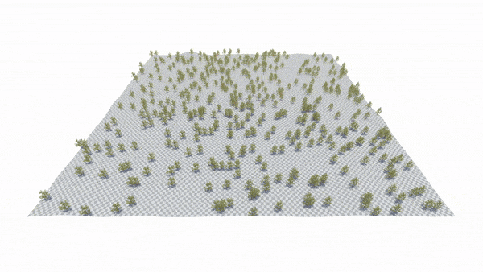
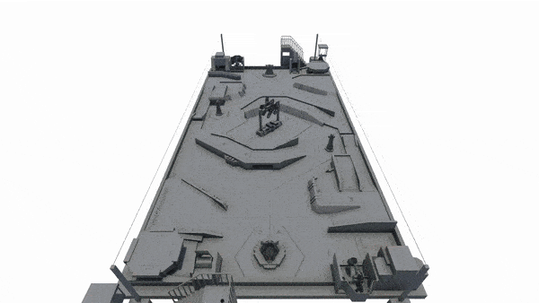
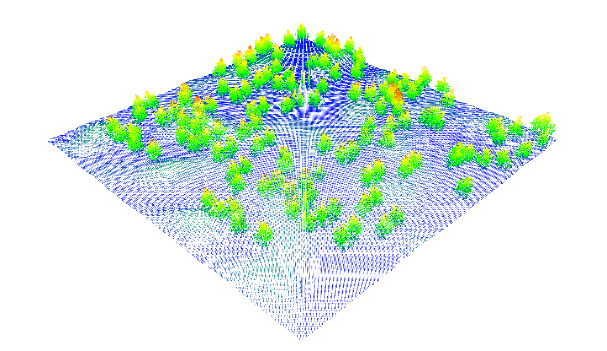
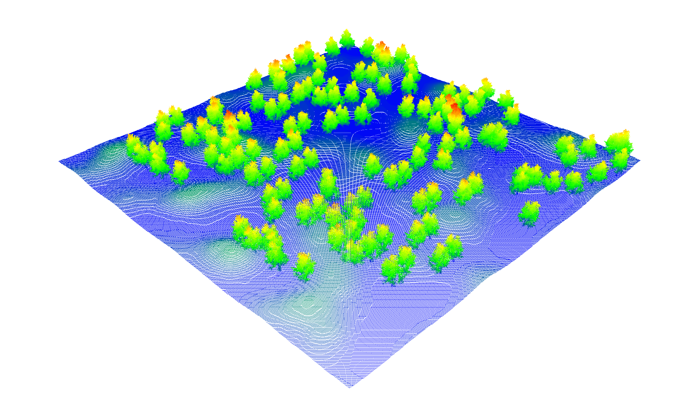
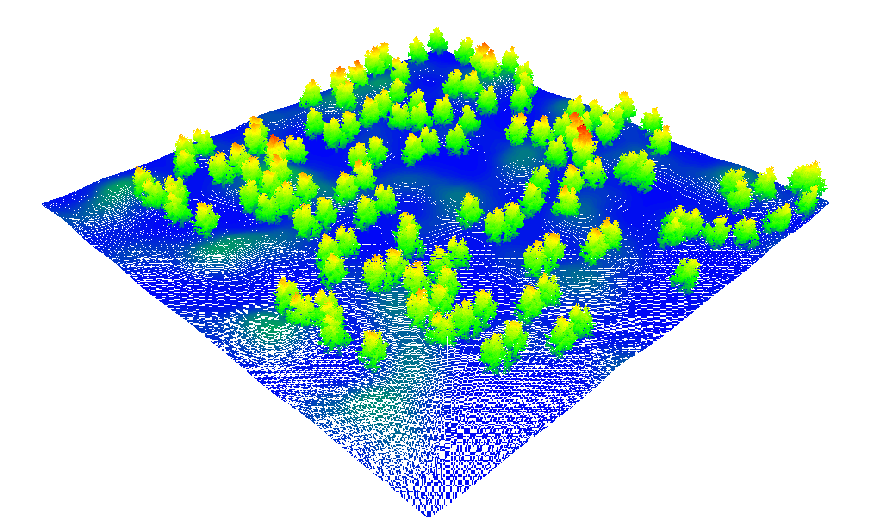
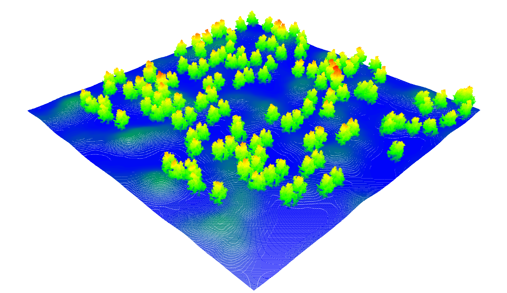
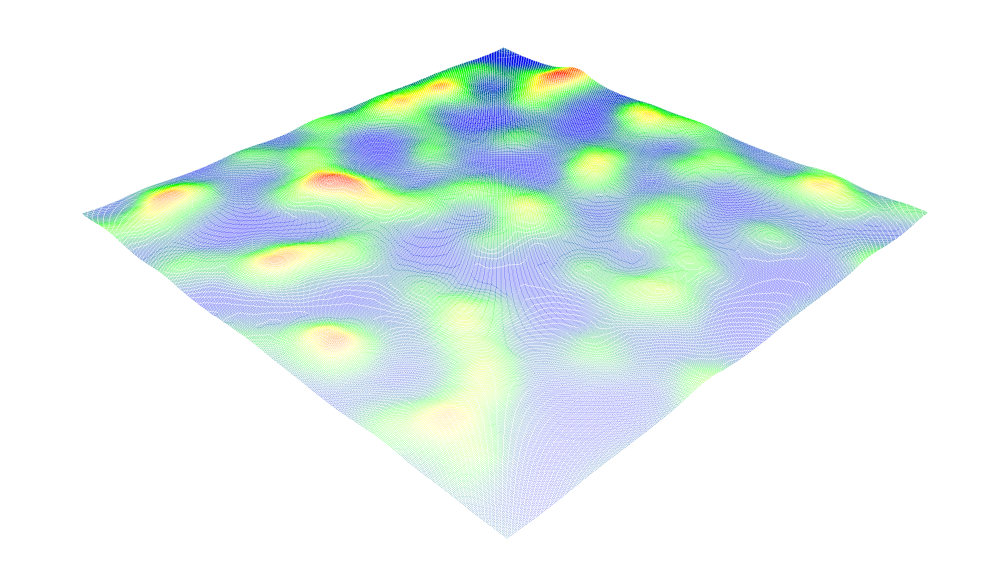
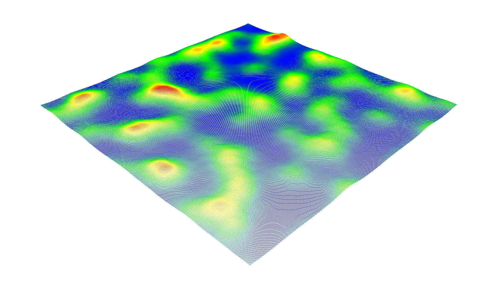
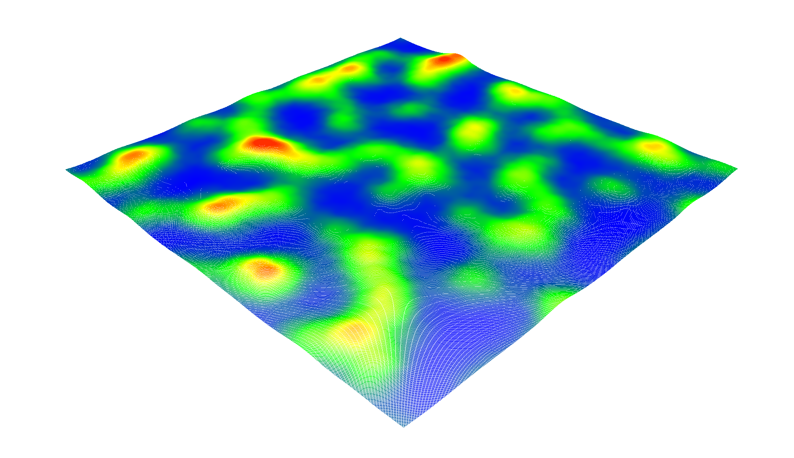
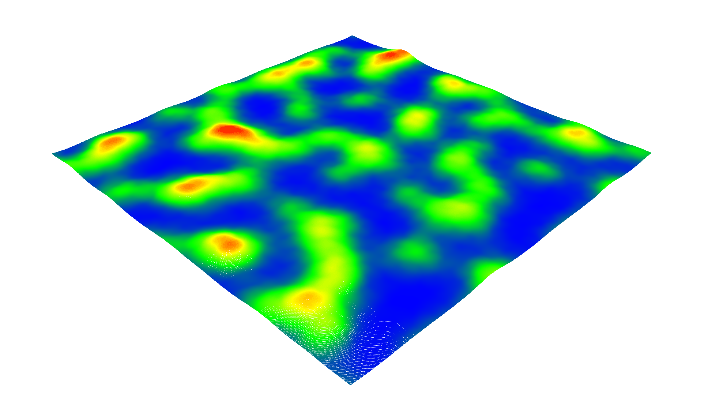

# VoxelGenerator for Unity

[](LICENSE)
[](https://unity.com/)
[](CONTRIBUTING.md)

---

|            Forest            |        RMUC Field        |
| :--------------------------: | :----------------------: |
|  |  |
|         1.0 M Points         |       2.3M Points        |
|         0.45 seconds         |       0.62 seconds       |

## Table of Contents

- [Overview](#overview)
- [Key Features](#key-features)
- [Dependencies](#dependencies)
- [Supported Versions](#supported-versions)
- [Installation](#installation)
- [Quick Start](#quick-start)
- [How to Use](#how-to-use)
- [Visualization](#visualization)
- [Core Concepts](#core-concepts)
- [Performance](#performance)
- [Contributing](#contributing)
- [Thanks](#thanks)
- [License](#license)

## Overview

This project is a Unity package for real-time point cloud generation based on scene colliders. It provides two primary methods:

-   **VoxelGeneratorOverlap**: Utilizes an octree-like approach, performing parallel overlap detections from coarse to fine levels. Ideal for generating spatial voxel point clouds.
-   **VoxelGeneratorRaycast**: Casts rays from the sky downwards to detect the ground. Best suited for generating terrain or ground-level point clouds.

Both methods leverage Unity's C# Job System, Burst Compiler, and Native Collections for high-performance, parallel computation.

## Key Features

-   **Real-time Generation**: Generate point clouds for large-scale scenes in real-time.
-   **High Performance**: Utilizes a hierarchical parallel detection strategy for efficient voxel generation.
-   **Data Export**: Supports exporting point cloud data to `.ply` and `.pcd` files.
-   **Extensible**: Designed with a clean and modular code structure for easy customization and extension.

## Dependencies
This package relies on the following Unity packages. Please ensure they are installed in your project:
- `com.unity.jobs`
- `com.unity.burst`
- `com.unity.collections`

## Supported Versions

**Unity 2022.3 or newer**
-   **Note**: Unity 2023 is not recommended due to instability in the core `OverlapSphereCommand` and `RaycastCommand` APIs.

## Installation

You can install this package via Git URL in Unity Package Manager:
```
https://github.com/TJU-Aerial-Robotics/VoxelGenerator.git?path=/Packages/VoxelGenerator
```

-   Navigate to `Window` > `Package Manager`.
-   Click on the `+` icon in the top left corner.
-   Select `Add package from git URL...`.
-   Paste the URL above and click `Add`.

## Quick Start

1.  Create a project with Unity 2022.3 or a newer version.
2.  Install the package via Unity Package Manager using the Git URL provided above.
3.  Import the Sample Scene from the package to your project.
    -   Navigate to `Window` > `Package Manager`.
    -   Select the `VoxelGenerator` package and click on `Import Sample`.
    -   Choose the `SampleScene` to import.
4.  Open the `SampleScene` and enter Play mode to see the point cloud generation in action.

## How to Use

1.  Add either the `VoxelGeneratorOverlap` or `VoxelGeneratorRaycast` prefab to your scene.
2.  Adjust the parameters in the Inspector to define the generation area and precision.
3.  Call the `StartGeneration()` and `ClearPointCloud()` public methods to control the generation process from your scripts. Alternatively, use the built-in shortcuts: press `P` to start generation and `R` to clear the point cloud.

**Key Parameters (`VoxelGeneratorBase`):**

-   `Voxel Size`: The size of the smallest voxel.
-   `Max Depth`: The maximum depth of the octree subdivision.
-   `Target Layer`: The physics layer to detect colliders on.
-   `File Name`: The name of the output `.ply` or `pcd` file.

## Visualization

You can use the [Pcx](https://github.com/keijiro/Pcx.git) package, which provides a simple way to render point clouds in Unity, or use external tools like [CloudCompare](https://www.cloudcompare.org/) or [Meshlab](http://www.meshlab.net/) to visualize the generated point clouds.

## Core Concepts

### `VoxelGeneratorOverlap`

This method recursively subdivides a defined bounding box into eight octants (an octree). At each level of depth, it performs a batch of `OverlapSphereCommand` checks in parallel to determine if any colliders are present within each octant. If an octant is occupied and the max depth has not been reached, it is subdivided further. This continues until the finest voxel level is reached, generating a dense spatial point cloud.

### `VoxelGeneratorRaycast`

This method creates a grid of points above the target area and casts rays downwards using `RaycastCommand`. The hit points on the collider surfaces form the resulting point cloud. It is highly efficient for creating 2.5D height maps or ground scans.

## Performance

Both methods are optimized for performance using Unity's Job System and Burst Compiler. The `VoxelGeneratorOverlap` method is particularly efficient for large scenes with complex geometry, while the `VoxelGeneratorRaycast` method excels in scenarios where terrain or ground-level data is required.

### `VoxelGeneratorOverlap` Performance

|    Snapshot    |  |  |  |  |
| :------------: | :-------------------------: | :----------------------------: | :--------------------------: | :-----------------------------: |
|  Total Points  |           0.66 M            |             2.19 M             |            5.15 M            |             10.02 M             |
|   Flightmare   |            7.01s            |             20.47s             |            45.23s            |             85.31s              |
| VoxelGenerator |            0.35s            |             0.45s              |            0.82s             |              0.99s              |

### `VoxelGeneratorRaycast` Performance

|    Snapshot    |  |  |  |  |
| :------------: | :-------------------------: | :----------------------------: | :--------------------------: | :-----------------------------: |
|  Total Points  |           0.25 M            |             0.56 M             |            1.00 M            |              2.25M              |
| VoxelGenerator |            54ms             |              35ms              |             52ms             |              129ms              |

## Contributing

Contributions are welcome! Please feel free to submit a pull request. For more details, see [CONTRIBUTING.md](CONTRIBUTING.md).

## Thanks

This project is inspired by [Flightmare](https://github.com/uzh-rpg/flightmare_unity).

## Cite
If you use this package in your research or projects, please cite it as follows:

```
@misc{YOPO-Rally,
      title={YOPO-Rally: A Sim-to-Real Single-Stage Planner for Off-Road Terrain}, 
      author={Hongyu Cao and Junjie Lu and Xuewei Zhang and Yulin Hui and Zhiyu Li and Bailing Tian},
      year={2025},
      eprint={2505.18714},
      archivePrefix={arXiv},
      primaryClass={cs.RO},
      url={https://arxiv.org/abs/2505.18714}, 
}
```

## License

This project is licensed under the [Apache-2.0 License](LICENSE).